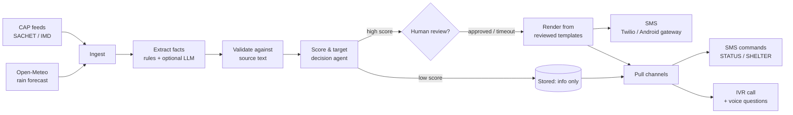

# CommBot

Multilingual disaster alerts over SMS and phone calls, built to keep working when the internet doesn't.

CommBot reads official warnings (CAP alerts from NDMA's SACHET platform, IMD, state disaster authorities), decides who needs to hear what, turns each alert into a short message in the person's own language, and sends it by SMS. People can also text back or call in to ask "what's happening?", "where's the relief camp?" or "what number do I call?".

This README is the full build guide. If you follow it top to bottom you'll go from zero to a working system you can demo, then to something you could responsibly pilot with a district authority or NGO.

---

## Contents

1. [How it works](#1-how-it-works)
2. [Project layout](#2-project-layout)
3. [Five-minute demo](#3-five-minute-demo)
4. [Build guide, phase by phase](#4-build-guide-phase-by-phase)
5. [Safety design (read this before changing anything)](#5-safety-design)
6. [Compliance checklist for India](#6-compliance-checklist-for-india)
7. [Testing and drills](#7-testing-and-drills)
8. [Deployment](#8-deployment)
9. [Roadmap](#9-roadmap)
10. [FAQ: why not LangChain / OpenAI Whisper?](#10-faq)

---

## 1. How it works



The big idea is that **the LLM never writes the warning**. It only picks from fixed lists (hazard type, recommended actions) and copies text that really exists in the official alert (place names, shelter names). Everything it returns is checked against the source, and anything that can't be found there is thrown away. The actual SMS is assembled from phrase templates that a native speaker has reviewed.

The second big idea is **push vs pull**. Only serious, official alerts get pushed as SMS. Everything else (minor advisories, model forecasts) is stored and available when someone asks. This avoids alert fatigue, which is what makes people ignore the one message that matters.

---

## 2. Project layout

```
commbot/
├── commbot/
│   ├── config.py          # all settings from env vars / .env
│   ├── models.py          # RawAlert, AlertFacts, Subscriber
│   ├── ingest/
│   │   ├── cap_feed.py    # CAP XML + RSS/Atom feeds + local files
│   │   └── weather.py     # Open-Meteo heavy-rain forecasts (unofficial)
│   ├── extract.py         # rules + LLM extraction with validation
│   ├── llm.py             # Hugging Face wrapper, optional
│   ├── localize.py        # Hindi/English templates, SMS length fitting
│   ├── prioritize.py      # scoring, targeting, dedup, rate limits
│   ├── geo.py             # place-name matching, point-in-polygon
│   ├── storage.py         # SQLite
│   ├── pipeline.py        # collect -> ingest -> review -> dispatch
│   ├── channels/sms.py    # console / Twilio / HTTP gateway senders
│   ├── commands.py        # inbound SMS commands
│   ├── qa.py              # grounded answers to citizen questions
│   ├── asr.py             # speech-to-text (faster-whisper)
│   ├── webhooks.py        # Flask: /sms, /voice, /voice/menu, /voice/question
│   ├── firebase_sync.py   # optional dashboard mirror
│   ├── cli.py             # command-line entry point
│   └── wsgi.py            # for gunicorn
├── samples/               # FAKE CAP alerts for testing
├── tests/test_core.py
├── scripts/commbot-poller.service
├── Dockerfile
├── requirements.txt
├── requirements-optional.txt
└── .env.example
```

---

## 3. Five-minute demo

No accounts, no API keys, no internet needed.

```bash
python -m venv .venv
source .venv/bin/activate          # Windows: .venv\Scripts\activate
pip install -r requirements.txt

python -m commbot.cli demo
pytest -q
```

The demo registers three fake subscribers, ingests the sample alerts, sends SMS to the console, shows that duplicates aren't re-sent, simulates citizens texting in, and prints what a caller would hear. You should see the flood SMS go to the two Bahraich numbers (one Hindi, one English) and **not** to the Gorakhpur number, the minor heat advisory stored but not pushed, and the drill alert ignored entirely.

---

## 4. Build guide, phase by phase

Each phase ends with a "done when" check. Don't move on until it passes; it's much easier to debug one layer at a time.

### Phase 0: Setup

Install Python 3.10+ and Git, then create the virtual environment as in the demo. Copy `.env.example` to `.env`. Leave `SMS_PROVIDER=console` until Phase 5, so you can't accidentally text real people.

**Done when:** `python -m commbot.cli demo` and `pytest -q` both succeed.

### Phase 1: Ingest official alerts

**Why CAP?** The Common Alerting Protocol is the international standard for public warnings, and India's NDMA publishes alerts in CAP through the SACHET platform. CAP gives you severity, urgency, certainty, expiry and exact area polygons in a machine-readable form. That's far more reliable than scraping press releases, and it keeps you relaying official information rather than creating your own warnings.

1. Visit the SACHET portal (sachet.ndma.gov.in) and find the public RSS/CAP feed link. Put it in `CAP_FEEDS`. You can list several feeds separated by commas, including your state's feed if it has one.
2. Run `python -m commbot.cli -v run-once` and watch the logs.
3. If a feed's format differs slightly from the standard, fix it in `cap_feed.py`, not downstream. `_strip_ns()` already handles CAP 1.1, 1.2 and namespace-less feeds.
4. Optionally add `WEATHER_POINTS` for heavy-rain forecasts from Open-Meteo. These use IMD's rainfall categories (64.5 / 115.6 / 204.5 mm per day) but are marked **unofficial**, so they're never pushed on their own.

Things `cap_feed.py` already takes care of for you: alerts with `status` other than `Actual` (exercises, tests, drafts) are dropped; `Cancel` messages retire the alerts they reference; `Update` messages replace the old version; and when an alert has several `<info>` blocks in different languages, the English one is used for extraction.

**Done when:** real alerts show up in `commbot.db` (`sqlite3 commbot.db "select alert_id, status, score from alerts"`).

### Phase 2: Extract facts (rules first, LLM second)

Open `extract.py`. Extraction works in three layers.

The **rules layer** always runs. It maps keywords (English and Hindi) to hazard types and action codes, pulls phone numbers with a regex that won't mistake dates or rainfall figures for numbers, and finds relief camps with a simple pattern. This alone handles most CAP alerts, because CAP already structures the important fields.

The **LLM layer** is optional. Set `LLM_ENABLED=true`, add your `HF_TOKEN`, and `pip install huggingface_hub`. The prompt (`SYSTEM_PROMPT` in `extract.py`) asks for JSON only, restricts hazards and actions to fixed lists, and tells the model to copy names exactly. Any instruction-tuned model that follows JSON instructions well will do; try a few on your real alerts and compare.

The **validation layer** is the important part. CAP's own severity always beats the LLM's. Areas, shelters and phone numbers from the LLM are kept only if they appear in the source text. Unknown action codes are dropped. And `EVACUATE` is removed unless the source actually says to evacuate, because an unnecessary evacuation order causes panic and blocks roads. Every dropped item is logged as a warning, which reviewers see in `commbot pending`.

If the LLM is down, slow or returns junk, the system silently falls back to rules. **Don't make the LLM a hard dependency.** During a disaster, the internet link to an inference API is exactly the thing that fails.

**Done when:** `pytest -q -k extract` passes, and you've run 20+ real past alerts through `extract_facts()` and checked the output by hand.

### Phase 3: Localize

Open `localize.py`. Messages are built from **reviewed phrase templates**, not machine-translated on the fly, because a bad translation of "move to higher ground" is a safety problem.

To add a language (say Bengali):

1. Copy the `"en"` block in `TEMPLATES` and give it the key `"bn"`.
2. Translate every phrase. Keep them short: one non-Latin character switches the whole SMS to Unicode, which fits only 70 characters per segment instead of 160.
3. **Get a native speaker to review every line**, ideally someone who has worked with local communities, and ask them to check register (plain, respectful, not bureaucratic).
4. Add `"bn"` to `SUPPORTED_LANGS` and extend `PLACE_NAMES_HI` (or add a `PLACE_NAMES_BN`) so place names appear in the local script.
5. Run `python -m commbot.cli preview <alert_id>` and read the output aloud.

You can use IndicTrans2 (AI4Bharat) or the Bhashini translation API to produce a *first draft* of the templates. Just don't skip step 3.

`render_sms()` fits each message into `MAX_SMS_SEGMENTS`, trimming in this order: extra actions, then the list of areas, then the source name, then the camp name. The hazard, the first action and a helpline number are never dropped. If no helpline is in the source, 112 is used.

**Done when:** every template has been reviewed by a native speaker and `preview` output reads naturally.

### Phase 4: The decision agent

Open `prioritize.py`. The score is `severity × urgency × certainty × trust`, on a scale from 0 to 12. With the default `PUSH_THRESHOLD=6`, a Severe alert that's Immediate and Likely scores 7.2 and is pushed, while a Moderate, Expected, Likely one scores 3.2 and is only available on request. Unofficial sources get a 0.6 multiplier, which keeps model forecasts below the push line.

Targeting uses GPS (polygon or circle from CAP) when a subscriber has coordinates, and falls back to whole-word district name matching.

Before each SMS, `should_send()` checks that the person hasn't already received this alert, that they haven't had the same story (same hazard and areas) within `RESEND_COOLDOWN_MIN` unless it has gotten worse, and that they haven't passed `MAX_SMS_PER_HOUR`. Extreme alerts ignore the hourly limit.

It's deliberately rule-based rather than an ML model. When a district officer asks "why did my village get this at 3am?", you need a clear answer, and every decision logs a reason.

With `REQUIRE_APPROVAL=true`, pushable alerts wait in a review queue:

```bash
python -m commbot.cli pending
python -m commbot.cli approve "sachet.ndma.gov.in:ALERT-ID" --by "Duty officer name"
python -m commbot.cli reject  "sachet.ndma.gov.in:ALERT-ID" --by "Duty officer name"
```

Official alerts not reviewed within `APPROVAL_TIMEOUT_MIN` go out automatically, and official Extreme alerts skip the queue altogether. Tune these with your partner authority; the defaults are a starting point, not a recommendation.

**Done when:** you've tuned the threshold on a set of past alerts, and a partner agrees with which ones would have been pushed.

### Phase 5: Send SMS

**For development**, stay on `console`.

**With Twilio**, set `SMS_PROVIDER=twilio` and fill in the three `TWILIO_*` values. Start with a trial account and verified numbers only.

**For India specifically**, commercial (A2P) SMS must go through TRAI's DLT system: you register as a business entity, register a sender ID (header), and get each message template approved. This takes time, so start early. The fixed templates in `localize.py` map naturally onto DLT templates, with variables for areas, phone numbers and times. Indian SMS providers often make DLT registration smoother than international ones, so compare options. Check each provider's current requirements before committing.

**For offline resilience**, set `SMS_PROVIDER=http_gateway` and point `SMS_GATEWAY_URL` at an Android phone running an open-source SMS gateway app on the same local network. It sends through the phone's own SIM, so it works with no internet at all, only cell signal. Adjust `HTTPGatewaySender.payload()` to match your app's API. It's slow (a few messages per second at most) and the SIM's own sending limits apply, so treat it as the fallback, not the main path.

**Done when:** a test phone receives the flood sample in Hindi and English, and you've checked how the Hindi message displays on a basic feature phone.

### Phase 6: Inbound SMS and the IVR line

1. Run the webhook server: `python -m commbot.cli serve --port 5000`.
2. Expose it over HTTPS while testing. With ngrok: `ngrok http 5000`. Put the https URL in `PUBLIC_BASE_URL`.
3. In the Twilio console, set your number's **Messaging** webhook to `POST {PUBLIC_BASE_URL}/sms` and **Voice** webhook to `POST {PUBLIC_BASE_URL}/voice`.
4. Keep `VALIDATE_TWILIO_SIGNATURE=true`. Without it, anyone who finds your URL can send fake commands. The code rebuilds the public URL from `PUBLIC_BASE_URL`, because behind ngrok or a proxy the internal URL won't match Twilio's signature.

SMS commands: `JOIN <district> [HI/EN]`, `STATUS`, `SHELTER`, `HELPLINE`, `STOP`, `HELP`.

The voice flow reads the latest alert for the caller's district, then offers "press 1 to repeat, press 2 to ask a question". Phone numbers are read digit by digit ("1 0 7 7") so callers can actually dial them.

A popular option in India is a **missed-call** line: the person gives a missed call and the system calls them back, so it costs them nothing. You can build this by making the incoming call handler reject the call and trigger an outbound call through the provider's API to the same `/voice` flow.

**Done when:** you can text `JOIN Bahraich EN` then `STATUS`, and call the number and hear the alert.

### Phase 7: Voice questions

```bash
pip install faster-whisper
```

When a caller presses 2, the call is recorded (up to 15 seconds), downloaded, transcribed with Whisper, matched to an intent (status / shelter / helpline) by keywords, and answered **only from stored official alerts**. Anything else gets "I can only share official alert information, call 112". A free-form chatbot answering "is the road to Mahsi safe?" would be tempted to invent an answer, and that's exactly what we must never do.

Some things to know. Twilio waits about 15 seconds for the webhook, so use `ASR_MODEL_SIZE=small` or `base` on CPU and measure; if it's too slow, switch to an asynchronous callback (record, hang up, call back with the answer). Whisper also struggles with 8 kHz phone audio and regional speech, so record 50+ real test questions from people in your area and compare Whisper against AI4Bharat's Indic ASR models and the Bhashini ASR API; swapping means replacing one function, `asr.transcribe()`. Recordings are deleted right after transcription.

**Done when:** at least 80% of your real test questions get the right intent. Improve the keyword lists in `qa.py` with the words people actually used.

### Phase 8: Resilience and the edge box

Plan for three failure levels.

| Situation | What still works |
|---|---|
| Everything up | Cloud server, Twilio SMS, IVR, LLM |
| Internet down, cell network up | Edge box on local power with SQLite, cached alerts, rules-only extraction, `http_gateway` SMS through an Android phone. For inbound SMS, add a small route that receives your gateway app's forwarded messages and calls `handle_sms_command()` |
| Cell network down | Out of scope for SMS. Look at LoRa mesh (Meshtastic) nodes at panchayat offices and community radio as a stretch goal |

The edge box can be a Raspberry Pi or old laptop with a UPS or solar battery, running the same code (see `scripts/commbot-poller.service`). Keep a copy of the subscriber list on it. Test it by physically unplugging the router.

### Phase 9: Dashboard (optional)

```bash
pip install firebase-admin
```

Set `FIREBASE_CREDENTIALS` to a service account JSON path. Alerts are mirrored to a Firestore `alerts` collection so a simple web dashboard can show live, pending and sent alerts. SQLite remains the source of truth, and a Firebase failure never blocks an alert.

---

## 5. Safety design

These are the rules the code is built around. If you change the code, keep them true.

1. **The LLM picks and copies; it never writes warnings.** All outgoing text comes from reviewed templates plus validated fields.
2. **Official structured data beats model output.** CAP severity, urgency and areas are never overridden by an LLM.
3. **If in doubt, leave it out.** Unverifiable numbers, shelters and places are dropped and logged.
4. **No evacuation orders the source didn't give.**
5. **Drills never reach phones.** Only `status=Actual` alerts are processed.
6. **Always give a working number.** Fall back to 112.
7. **Always say where it came from.** Messages name the source so people know it's a relay of official information, not CommBot's own warning.
8. **Unofficial forecasts are never pushed.**
9. **Degrade, don't die.** Every external dependency (LLM, feeds, Firebase, ASR) can fail without stopping alerts.

---

## 6. Compliance checklist for India

This isn't legal advice; check current rules with your partners and providers.

- **TRAI DLT** registration for sender ID and templates before any bulk SMS.
- **Consent (DPDP Act, 2023):** subscribe only people who opt in (`JOIN`), honour `STOP` immediately, collect only phone, district and language, and write down how long you keep data and who can see it.
- **Don't impersonate authorities.** Brand messages as CommBot, cite the official source, and get written agreement from any authority whose alerts you relay at scale.
- **Audit trail:** the `alerts` and `deliveries` tables record what was sent, to whom, when and who approved it. Back them up.
- **Accessibility:** voice for people who can't read SMS, plain language, local scripts.

---

## 7. Testing and drills

```bash
pytest -q                 # unit tests, including the hallucination tests
python -m commbot.cli demo
```

Before any pilot, run a **tabletop drill**: replay last monsoon's real alerts through the system with `SMS_PROVIDER=console`, and have your partner check every message. Then run a **live drill** with volunteer phones only, and measure time from the bulletin being published to the SMS arriving, the percentage delivered, whether people understood the message (ask them to explain it back), and whether the offline path works with the router unplugged.

---

## 8. Deployment

**Single server:**

```bash
# web server
gunicorn "commbot.wsgi:app" -b 0.0.0.0:5000 -w 2 --timeout 30
# poller (separate process)
python -m commbot.cli run
```

Put the web server behind HTTPS (Caddy or nginx with Let's Encrypt).

**Docker:**

```bash
docker build -t commbot .
docker run -d --env-file .env -v commbot-data:/data -p 5000:5000 commbot
docker run -d --env-file .env -v commbot-data:/data commbot python -m commbot.cli run
```

**Edge box:** copy the project to `/opt/commbot`, create the venv, then install `scripts/commbot-poller.service` with systemd.

Back up `commbot.db` regularly. It's a single file.

---

## 9. Roadmap

- More languages (Bhojpuri, Awadhi, Bengali, Assamese, Odia...) with community-reviewed templates
- Automatic transliteration of place names (AI4Bharat IndicXlit) with a reviewed gazetteer
- Central Water Commission river-level data as an input
- Missed-call callback flow
- Async voice answers for slower ASR models
- Web dashboard for reviewers (approve/reject from a phone)
- Cell broadcast integration via the authorities, for mass reach without subscriptions
- LoRa mesh relay for when the cell network is down

---

## 10. FAQ

**Why isn't this using LangChain?** The LLM does one job here: a single structured-extraction call with strict validation. A plain client is easier to read, has fewer dependencies, and is easier to audit. If you later add multi-step agents or retrieval over large documents, `llm.py` is the one place to swap in LangChain.

**Why faster-whisper instead of OpenAI's whisper package?** Same models, but noticeably faster on CPU with int8 quantization, which matters because of the phone webhook timeout.

**Can I use this without Twilio?** Yes. Use `http_gateway` with an Android phone, or write a new `SMSSender` subclass for your provider. It's about 20 lines.

**Is the sample data real?** No. Everything in `samples/` is fake and clearly labelled. Never test with real alert identifiers on real phones.

---


