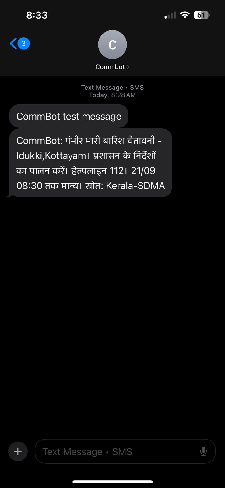

# CommBot

Disaster warnings from India's government feed, turned into Hindi or English SMS and sent to the districts affected.

**Live control room:** [commbot-wel7.onrender.com](https://commbot-wel7.onrender.com)

When a flood or storm warning is issued in India, it exists. It's published, it's accurate, and it's free to read. It just doesn't reach the person standing next to the river, because it's in English, on a website, behind a data connection they may not have.

CommBot closes that gap. It reads the official feed, extracts only what can be verified, and sends a short message in the reader's own language to a phone that costs ₹1,000 and has no internet.



*A live Kerala rainfall warning, translated and delivered as an SMS during testing.*

---

## How it works

1. **Read the official feed.** CommBot polls NDMA's SACHET platform every two minutes. Alerts come from IMD, the Central Water Commission and state disaster authorities in CAP format, so severity, urgency, area and expiry arrive as structured data rather than prose.

2. **Extract only the facts.** Hazard type, districts, recommended actions, helpline numbers, relief camps. Anything that can't be found word-for-word in the official text is discarded, including anything a language model suggests.

3. **Decide who needs it.** Each alert is scored on severity × urgency × certainty. Serious ones go to a human for approval; the rest stay available on request. People are matched by district name, or by GPS when the alert carries a boundary.

4. **Write it in their language.** Messages are built from phrases reviewed by native speakers, never machine-translated live. A Hindi SMS holds only 70 characters per part, so the hazard, the first action and a helpline are kept, and everything else is trimmed in a fixed order.

5. **Send it once.** SMS goes out through a phone gateway, which needs cell signal but no internet. The delivery log ensures nobody receives the same warning twice.

People subscribe by texting `JOIN <district>`, and leave by texting `STOP`. No app, no smartphone, no data.

---

## Why the language model never writes the warning

The model is the most constrained part of this system, deliberately.

It may do two things: **pick from a fixed list**, and **copy text that already exists in the alert**. It can say the hazard is `FLOOD`, because that's one of nine values I defined. It can name a relief camp, and I keep it only if that exact string appears in the government bulletin.

Everything else it returns is thrown away:

```python
# Our regex already finds every real number in the text, so any
# number the LLM returns that we *didn't* find is made up.
for phone in llm_output.get("helplines", []):
    if normalize(phone) not in helplines:
        warnings.append(f"Dropped helpline not found in source: {phone!r}")
```

There's a test that feeds the model a fake helpline, an invented shelter, a district not in the alert and an action code I never defined. All four must disappear or the build fails.

The rules the system follows:

- A language model may classify and copy. It never authors the warning.
- Official severity always beats anything inferred.
- No evacuation instruction unless the source says to evacuate.
- Drills and test alerts never reach a phone.
- Every message names its source and carries a working number to call.
- If the feed, the model or the network fails, alerts still go out via the simpler path.

The message reaches someone during a flood. They can't verify it, can't reach the issuing office, and will act on whatever it says. That's why boring and correct beats clever.

---

## What's real, and what the hosted copy can't do

**On a machine with a gateway phone connected, CommBot sends real SMS.** That's how the screenshot above happened: a live Kerala warning, translated to Hindi, delivered through an Android phone's SIM to another handset.

**The hosted copy at Render can't send**, because sending requires a phone with a SIM, and a cloud server doesn't have one. So the public site shows the real feed, the real decisions and the exact messages that would go out, with eight sample subscribers so the coverage pages aren't blank. Those are labelled as samples wherever they appear.

To send at scale you'd need either an SMS provider with TRAI DLT registration, or a dedicated Android phone kept online as the gateway.

---

## Running it yourself

Needs Python 3.11 or newer.

```bash
git clone https://github.com/makkergauri/commbot.git
cd commbot
python -m venv .venv
source .venv/bin/activate        # Windows: .venv\Scripts\activate
pip install -r requirements.txt
pytest -q                        # 38 tests
```

Copy `.env.example` to `.env` and set the feed:

CAP_FEEDS=https://sachet.ndma.gov.in/cap_public_website/rss/rss_india.xml
SMS_PROVIDER=console


Then:

```bash
python -m commbot.cli run-once                          # one fetch cycle
python -m commbot.cli add-subscriber --phone +91XXXXXXXXXX --district Bahraich --lang hi
python -m commbot.cli serve --port 5000                 # control room at /dashboard
```

With `SMS_PROVIDER=console`, messages print to the terminal instead of being sent, which is how you should develop.

### Sending real SMS

Install [SMS Gateway for Android](https://github.com/capcom6/android-sms-gateway) on a phone with a SIM, switch on its local server, and put its details in `.env`:

SMS_PROVIDER=android
SMS_GATEWAY_URL=http://192.168.1.5:8080
SMS_GATEWAY_USER=...
SMS_GATEWAY_PASS=...


Use a spare phone and SIM. That app can read every SMS the phone receives, including bank OTPs. CommBot ignores anything that isn't a mobile number, but the permission is still on the device.

---

## The control room

Five pages, server-rendered, no JavaScript, so it loads on a weak connection:

- **Overview**: what needs approving, a map of live warnings, breakdown by hazard
- **Alerts**: everything current, filterable
- **Coverage**: which districts are covered and in which language
- **Activity**: the delivery log, with numbers part-hidden
- **How it works**: the explanation, for anyone arriving cold

Approve buttons show the exact Hindi and English text that will be sent before you approve it.

---

## What real data taught me

Most of the work wasn't the pipeline, it was the mess the real feed contains.

**The area field is often useless.** Real values include `some parts`, `9 districts of Gujarat`, `6 Mandals` and `MOD TSRA`, which is aviation shorthand for thunderstorm with rain, not a place. Each needed its own rule, and where no area can be matched, CommBot logs the alert rather than pretending it can target it.

**Identifiers lie.** The feed's item id is `1789916877126017`; the alert inside it is `IN-1789916877126017_17`. I assumed they matched, which meant re-downloading every alert on every poll against a government server, invisibly, forever.

**Geometry can be absurd.** One alert carried 64,472 boundary points. They're now thinned to 400, which loses nothing at district scale.

**The bug only a phone could find.** After weeks of console testing, the first real SMS arrived at 8:28 for a warning valid until 8:30. Every layer was correct and the message was useless. CommBot now refuses to push anything with under fifteen minutes left, and there's a test named after it.

---

## Limitations

- **Hindi and English only.** Every new language needs a native speaker to review the phrases, and I'd rather have two correct languages than six risky ones.
- **Place names are transliterated from a small hand-written list**, so Hindi messages show some district names in Latin script.
- **Polygon fetching is capped** at 25 per cycle to be gentle on the government server, so some alerts are targeted by district name only.
- **A single SIM can't serve a district.** Indian prepaid plans typically cap around 100 SMS a day. Real deployment means DLT registration and a bulk provider.
- **No voice line.** An IVR version existed early on, then was removed when the project moved off Twilio.

---

## Next

- Bengali, Tamil, Marathi and Telugu, each reviewed by a native speaker before release
- Automatic transliteration of place names
- Central Water Commission river-level data as a second source
- A pilot with a district authority or NGO, which is the only real test of whether this helps

---

## Credits and licence

Alerts come from NDMA's SACHET platform, published by IMD, the Central Water Commission and state disaster management authorities. CommBot relays official warnings; it never issues its own. The India boundary is from [DataMeet's](https://github.com/datameet/maps) open map, CC-BY.

MIT licensed.